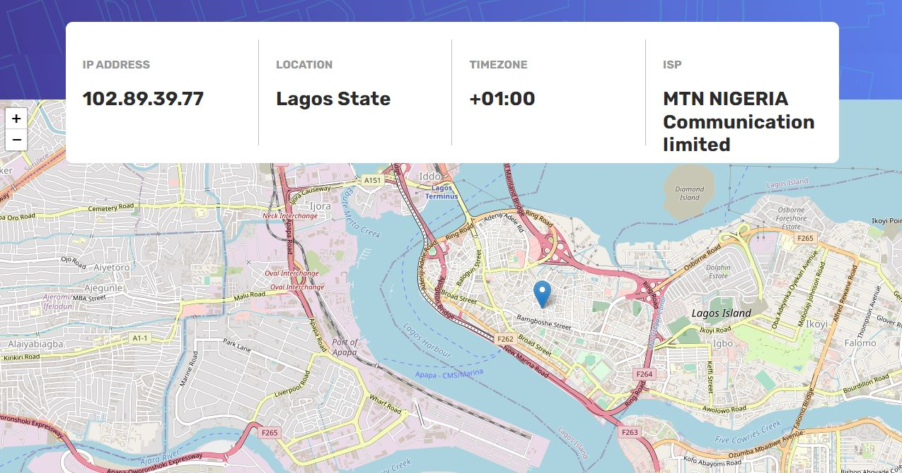

# Frontend Mentor - IP address tracker solution

This is a solution to the [IP address tracker challenge on Frontend Mentor](https://www.frontendmentor.io/challenges/ip-address-tracker-I8-0yYAH0). Frontend Mentor challenges help you improve your coding skills by building realistic projects. 

## Table of contents

- [Overview](#overview)
  - [The challenge](#the-challenge)
  - [Screenshot](#screenshot)
  - [Links](#links)
- [My process](#my-process)
  - [Built with](#built-with)
  - [What I learned](#what-i-learned)
  - [Continued development](#continued-development)
  - [Useful resources](#useful-resources)
- [Author](#author)
- [Acknowledgments](#acknowledgments)

## Overview

### The challenge

Users should be able to:

- View the optimal layout for each page depending on their device's screen size
- See hover states for all interactive elements on the page
- See their own IP address on the map on the initial page load
- Search for any IP addresses or domains and see the key information and location

### Screenshot



### Links

- Solution URL: [Add solution URL here](https://your-solution-url.com)
- Live Site URL: [Add live site URL here](https://your-live-site-url.com)

## My process

### Built with

- Semantic HTML5 markup
- CSS custom properties
- Flexbox
- CSS Grid
- Mobile-first workflow
- [React](https://reactjs.org/) - JS library
- [geo.ipify API](https://geo.ipify.org/) - API
- [React-Leaflet](https://react-leaflet.js.org/) - React Leaflet

### What I learned
I learn how to set state and initialize state with the useState hook.

```js
const [ip,setIp] = useState("")
const [state,setState] = useState( JSON.parse(localStorage.getItem("state")) || {"ip":"","location":{"country":"US","region":"","city":"","lat":37.38605,"lng":-122.08385,"postalCode":"","timezone":"","geonameId":5375480},"domains":["bitc.blog","serveur-sg.fr","www.bitc.blog","www.drysaunabenefits.com","www.oursaunas.com"],"as":{"asn":15169,"name":"GOOGLE","route":"8.8.8.0/24","domain":"","type":"Content"},"isp":""})
const [input,setInput] = useState("")
```

I learnt how to fetch request from API using useEffect hook and also how to use localStorage

```js
React.useEffect(() =>{
        let apiKey = api-key;
        if (ip) {
            fetch('https://geo.ipify.org/api/v2/country,city?apiKey=' + apiKey + '&ipAddress=' + ip)
            .then(response => response.json())
            .then(data => setState(data))
        }
        else if (ip == "" && state.ip==""){
            fetch('https://geo.ipify.org/api/v2/country,city?apiKey=' + apiKey)
            .then(response => response.json())
            .then(data => setState(data))
        }
    },[ip])

React.useEffect(function(){
  localStorage.setItem("state",JSON.stringify(state))
},[state])
```

### Continued development
I wil be working more on React project in order to improved my technical skills.

### Useful resources

- [Learn react]([https://www.example.com](https://scrimba.com/learn/learnreact)) - This course by Bob Ziroll helped me navigate my challenges with React

## Author

- Mail - [Taiwo Ola-Balogun](taiwotriumphant@gmail.com)
- Frontend Mentor - [@Tiazzy](https://www.frontendmentor.io/profile/Tiazzy)
- Twitter - [@TayworT](https://www.twitter.com/TayworT)

## Acknowledgments
Thanks to Peter Ayeni for his [article](https://medium.com/weekly-webtips/getting-started-with-building-maps-with-react-and-leaflet-8ac6227f2099) on Medium on React and Leaflet
